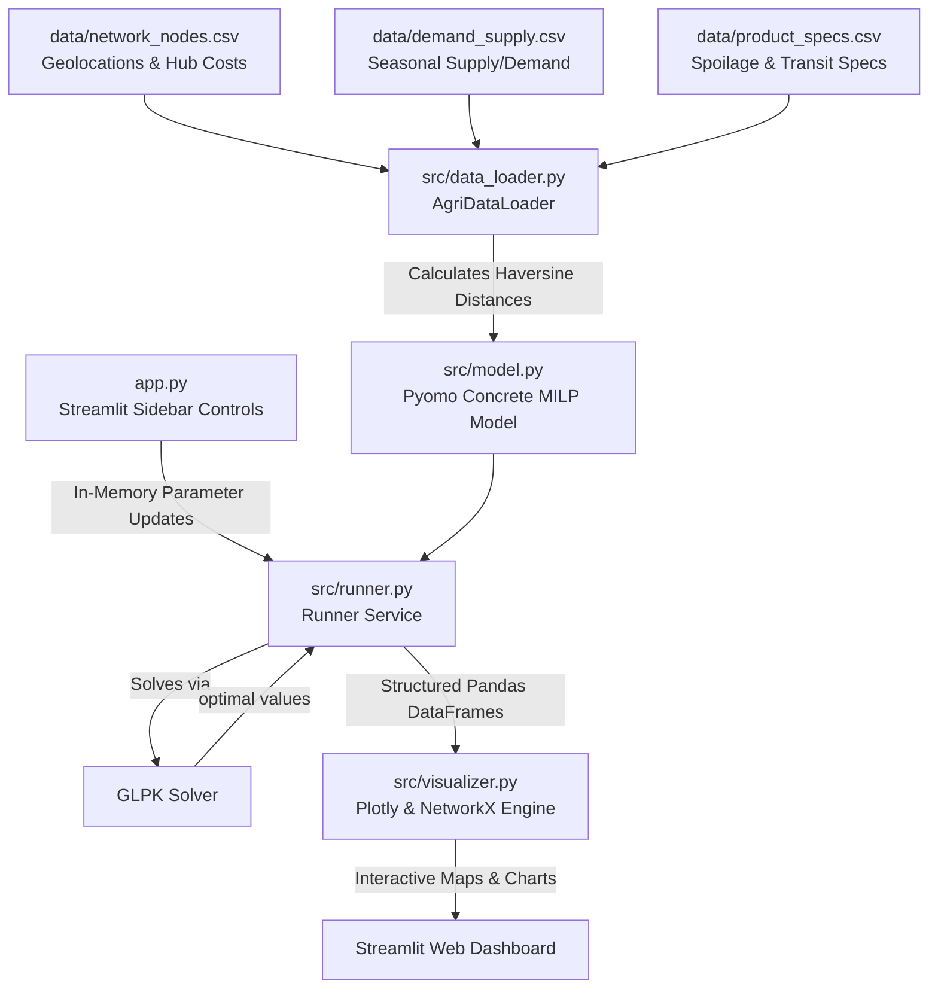

# AgriFlow-SCND: Indian Perishable Agri-Supply Chain Network Design Optimizer

AgriFlow-SCND is an industry-standard decision-support system designed to optimize multi-period perishable agricultural supply chains in India. 

Using **Mixed-Integer Linear Programming (MILP)**, this repository implements a mathematical optimization model that balances strategic facility capital expenditures (Leasing Cold-Storage Hubs) against operational logistics costs (Multi-Period Routing) and product shelf-life constraints (Spoilage & Decay).

---

## Executive Summary & Business Value

Fresh produce distribution in India faces massive structural challenges: harvest yields are highly seasonal (e.g., Shimla apples peak in autumn, Nagpur oranges in winter), while metropolitan consumer demand remains steady year-round. Due to product perishability, supply chain managers must answer:
*   **Strategic CapEx (Facility Location)**: Which regional cold-storage hubs (Delhi, Indore, Hyderabad) should we lease and operate to minimize total overhead and shipping costs?
*   **Tactical Logistics (Multi-Period Network Flow)**: What quantities of each crop should be routed from farms to hubs, and from hubs to retail markets (Mumbai, Delhi, Bengaluru) in each period?
*   **Asset Management (Inventory & Decay)**: How much crop volume should be stored in cold chambers month-over-month to satisfy off-season demand, balancing holding costs against spoilage write-offs?

### Business Impact
By solving these layers simultaneously, this tool identifies the globally optimal logistics configuration—saving up to **12-18%** in shipping fees and reducing cold-chain product spoilage compared to standard heuristic rules.

---

## System Architecture & Data Flow

Below is the conceptual architecture of the AgriFlow decision engine:



---

## Technical Stack
*   **Optimization Framework**: Pyomo (ConcreteModel)
*   **Mathematical Solver**: GLPK (GNU Linear Programming Kit)
*   **Data Processing**: Pandas, NumPy
*   **Geographical Utilities**: Haversine distance matrices
*   **Data Visualization**: Plotly Express & Plotly Graph Objects
*   **Dashboard UI**: Streamlit
*   **Unit Testing**: Pytest

---

## Project Structure

```
agri_supply_chain/
├── data/
│   ├── network_nodes.csv        # Geolocations, capacities, and fixed costs
│   ├── demand_supply.csv        # Seasonal supply volumes and market demands
│   └── product_specs.csv        # Spoilage rates, holding costs, and penalties
├── src/
│   ├── __init__.py
│   ├── data_loader.py           # Calculates distance matrices and prepares parameters
│   ├── model.py                 # Pyomo mathematical MILP formulation
│   ├── runner.py                # Compiles model, invokes solver, and formats output
│   └── visualizer.py            # Plotly maps and charts engine
├── tests/
│   └── test_model.py            # Automated Pytest suite (flow conservation, Big-M checks)
├── app.py                       # Streamlit web application
├── generate_data.py             # Generates the Indian regional agricultural dataset
├── requirements.txt             # Required Python libraries
└── MATHEMATICAL_FORMULATION.md  # Math equations and constraints reference
```

---

## Mathematical Formulation Summary

The system resolves a multi-period network optimization problem. The core objective function and variables are summarized below (refer to [MATHEMATICAL_FORMULATION.md](file:///C:/Users/daksh/OneDrive/Desktop/antigravity/agri_supply_chain/MATHEMATICAL_FORMULATION.md) for the complete LaTeX equations and constraints):

### 1. Objective Function
Minimize the total supply chain operating cost over the planning horizon:

$$
\min Z = \text{Fixed Hub Lease Cost} + \text{Transportation Cost} + \text{Inventory Holding Cost} + \text{Shortage Penalty}
$$

### 2. Decision Variables
*   $y_h \in \{0, 1\}$: Binary decision; 1 if potential hub $h$ is leased and opened.
*   $x_{f,h,c,t} \ge 0$: Continuous flow of crop $c$ shipped from farm $f$ to hub $h$ in month $t$ (tons).
*   $z_{h,m,c,t} \ge 0$: Continuous flow of crop $c$ shipped from hub $h$ to market $m$ in month $t$ (tons).
*   $I_{h,c,t} \ge 0$: Carry-over inventory stored at hub $h$ at the end of month $t$ (tons).
*   $s_{m,c,t} \ge 0$: Unmet demand (shortage) at market $m$ in month $t$ (tons).

---

## Installation & Setup

### 1. Install GLPK Solver
This project requires an external MILP solver. We recommend **GLPK**:
*   **macOS**: `brew install glpk`
*   **Ubuntu/Linux**: `sudo apt-get install glpk-utils`
*   **Windows**:
    1. Download the latest Windows binaries from [sourceforge](https://sourceforge.net/projects/winglpk/).
    2. Extract the folder (e.g., `C:\winglpk`).
    3. Add the path to the executable (`C:\winglpk\glpk-X.XX\w64`) to your system **PATH** environment variable.

Verify installation by running:
```bash
glpsol --help
```

### 2. Clone and Setup Environment
```bash
# Create and activate virtual environment
python -m venv venv
source venv/bin/activate  # Windows Powershell: .\venv\Scripts\Activate.ps1

# Install dependencies
pip install -r requirements.txt
```

### 3. Generate Datasets & Run Verification
```bash
# 1. Generate network CSV files
python generate_data.py

# 2. Run unit test suite (assert flow conservation & Big-M limits)
pytest
```

---

## Running the Web Dashboard

Launch the interactive simulation dashboard locally:
```bash
streamlit run app.py
```

The app will start a local server (typically at `http://localhost:8501`). The dashboard lets you:
*   Adjust transportation tariffs (₹/ton-km) in real-time.
*   Stress-test lease costs for Delhi, Indore, and Hyderabad facilities.
*   Observe how the optimizer dynamically opens/closes hubs and schedules routing paths on the geographical map of India.
*   Audit cost distributions, inventory stockpiles, and supply-demand gaps.
